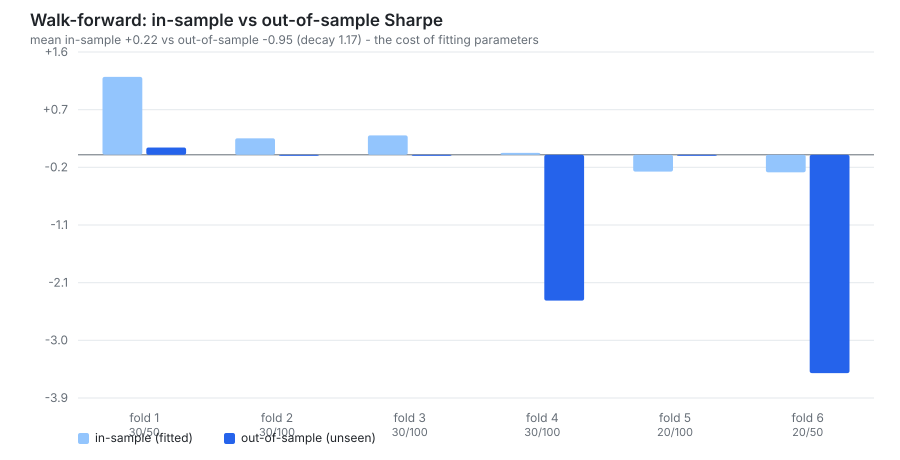
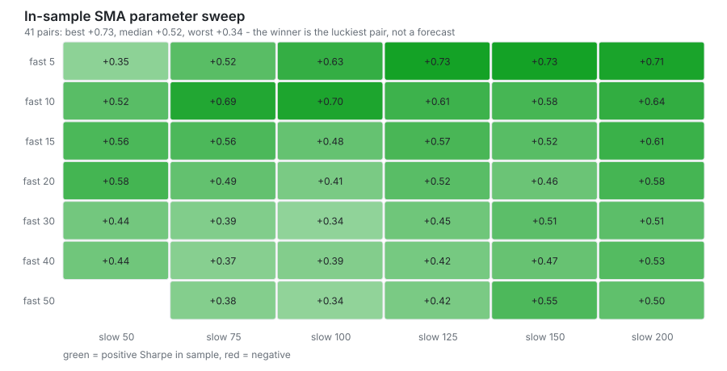
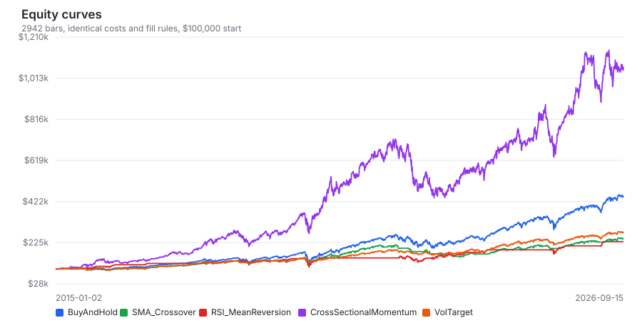
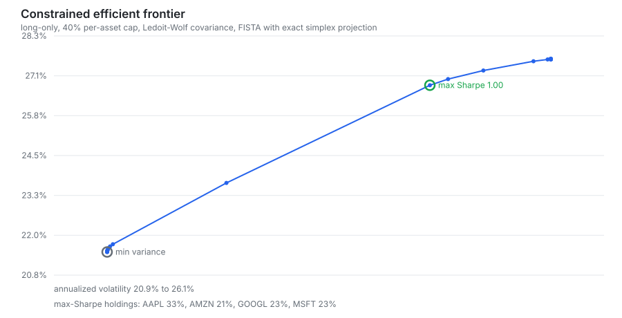

# AxiomQuant

[](https://github.com/Lukey-7/AxiomQuant/actions/workflows/ci.yml)
[](https://en.cppreference.com/w/cpp/20)
[](LICENSE)

A quantitative research engine in modern C++20: event-driven backtesting with realistic transaction
costs, risk and tail analytics, parallel Monte Carlo, Markowitz portfolio optimization, and
**walk-forward out-of-sample evaluation**. Every solver — the constrained QP, the Ledoit-Wolf
estimator, the VaR models, the random number generator — is implemented from first principles, with
Eigen used only for linear algebra and SQLite for persistence. The point of the project is not to
show a profitable strategy; it is to build machinery honest enough to tell you when a strategy is
not profitable. On 11.7 years of real prices it says exactly that: walk-forward SMA crossover returned
+32.3% out of sample against +254.6% for buy-and-hold SPY. See **[RESEARCH.md](RESEARCH.md)**.

43 unit and regression tests run on Linux (GCC), macOS (Apple Clang), Windows (MSVC) and under
AddressSanitizer + UndefinedBehaviorSanitizer on every push.

---

## Results at a glance

Parameters chosen on a training window, then traded unchanged on the next unseen window. The blue
bars are what the optimizer believed; the darker bars are what happened next.



Every pair in an in-sample parameter sweep. The best cell is the one the optimizer would have picked
— and it only just matches buy-and-hold (Sharpe 0.73 vs 0.71), while 38 of 41 pairs fall short.



<details>
<summary>Equity curves and the constrained efficient frontier</summary>





</details>

Charts come from [Real data run 34924940650](https://github.com/Lukey-7/AxiomQuant/actions/runs/34924940650)
(SPY, AAPL, AMZN, GOOGL, MSFT, 2015-01-02 to 2026-09-14). They are generated from the CLI's own CSV
exports by `scripts/make_charts.py`, which uses only the Python standard library:

```bash
./build/bin/axiomquant --data sample_data --no-db --export-dir out
python3 scripts/make_charts.py --input out --output docs/images
```

---

## Architecture

```
                 sample_data/*.csv                      SQLite (quant_data)
                        |                                  ^        |
                        v                                  |        v
            +-----------------------+   persists runs,  +-----------------------+
            |  quant_data           |   trades, curves  |  market_data          |
            |  CsvLoader            |------------------>|  backtest_runs        |
            |  TimeSeries (columnar)|                   |  trades, equity_curve |
            |  MarketDataUniverse   |                   +-----------------------+
            +-----------+-----------+
                        | synchronized timeline, aligned closes, slice()
        +---------------+----------------+--------------------------+
        v                                v                          v
+---------------------+   +-----------------------------+   +------------------------+
| quant_indicators    |   | quant_backtest              |   | quant_optimization     |
| SMA EMA RSI MACD    |-->| BacktestEngine (event loop) |   | sample & Ledoit-Wolf   |
| Bollinger ATR vol   |   | ExecutionModel (costs)      |   | GMV / tangency (exact) |
+---------------------+   | Portfolio, Position         |   | constrained QP (FISTA) |
                          | strategies: SMA, RSI,       |   | risk parity, frontier  |
                          |   momentum, buy & hold      |   +-----------+------------+
                          +--------------+--------------+               |
                                         |                              |
                 +-----------------------+------------+                 |
                 v                                    v                 v
      +---------------------+            +-------------------------------------+
      | quant_risk          |            | quant_analysis                      |
      | Sharpe Sortino      |            | evaluate_window (warm-up, no trade) |
      | Calmar drawdown     |            | sweep_sma_parameters (OpenMP)       |
      | VaR/CVaR: historical|            | run_sma_walk_forward (rolling OOS)  |
      | Gaussian, Cornish-  |            +-------------------+-----------------+
      | Fisher; reports     |                                |
      +----------+----------+                                |
                 |                                           |
                 v                                           v
      +-------------------------------+          +--------------------------+
      | quant_simulation              |          | cli: axiomquant          |
      | bootstrap + correlated GBM    |--------->| 8-stage pipeline, CSV    |
      | deterministic per-path RNG    |          | export, SQLite, reports  |
      +-------------------------------+          +--------------------------+
```

---

## Modules

### `quant::data`
Columnar `TimeSeries` (separate OHLCV vectors for vectorization-friendly access), a CSV loader that
accepts arbitrary column order and skips malformed rows, and `MarketDataUniverse`, which synchronizes
multiple assets onto one timeline (intersection, or union with forward-fill). It exposes
`get_aligned_closes()` for indicator computation and `slice()` for walk-forward windows.
`SqliteStorage` persists price history, run summaries, fills and equity curves.

### `quant::indicators`
SMA (O(1) rolling accumulator), EMA (α = 2/(N+1), SMA-seeded), RSI (Wilder smoothing), MACD,
Bollinger Bands with %B and bandwidth, annualized rolling volatility of log returns
(σ_ann = √252 · std(ln(P_t/P_{t-1}))), and ATR over Wilder's true range
(max(H−L, |H−C_prev|, |L−C_prev|)). Warm-up values are NaN, never silently zero.

### `quant::backtest`
Event-driven loop over the synchronized timeline. Orders emitted on bar *t* execute at bar *t+1*'s
open (`FillTiming::NextBarOpen`, the default); `SameBarClose` exists only for comparison studies.
The execution model charges per-share and percentage commissions with a minimum ticket, a half
bid-ask spread, fixed slippage, and square-root market impact ΔP/P = η·√(Q/V). Positions track
average cost, realized and unrealized PnL; every fill records the PnL it realized and whether it
closed a position. Strategies: SMA crossover, RSI mean reversion, cross-sectional momentum (with an
optional absolute-momentum filter), and buy-and-hold.

### `quant::risk`
CAGR from the calendar span, annualized volatility, Sharpe, Sortino (downside semi-deviation below
MAR), Calmar, drawdown depth/duration/recovery, skewness and excess kurtosis. VaR and CVaR three
ways — historical (empirical quantile), Gaussian parametric, and Cornish-Fisher, which corrects the
normal quantile for skew and fat tails:

```
z_cf = z + (S/6)(z² − 1) + (K/24)(z³ − 3z) − (S²/36)(2z³ − 5z)
```

Trade statistics (win rate, profit factor, average trade) are computed from realized PnL on closing
fills.

### `quant::simulation`
Monte Carlo with one xoshiro256\*\* stream per path, seeded from (seed, path index) by SplitMix64, and
a Marsaglia polar normal sampler. Output is bit-identical at any thread count and on any standard
library. Two engines: i.i.d. bootstrap resampling of a historical return series, and a correlated
multi-asset GBM that draws x_t = drift + L·z_t with L·Lᵀ = Σ_daily (Cholesky) and values a
buy-and-hold or daily-rebalanced portfolio. Paths are streamed — no allocation per path.

### `quant::optimization`
Sample covariance and **Ledoit-Wolf shrinkage to the constant-correlation target** (Ledoit & Wolf,
2004), including the ρ term of the optimal intensity:

```
Σ_LW = δF + (1−δ)S,   F_ii = s_ii,  F_ij = r̄·√(s_ii·s_jj),   δ = clamp((π̂ − ρ̂)/(T·γ̂), 0, 1)
```

Closed-form GMV `w = Σ⁻¹1 / 1ᵀΣ⁻¹1` and tangency `w ∝ Σ⁻¹(μ − r_f·1)`, a constrained QP solved by
Nesterov-accelerated projected gradient (FISTA) onto the bounded simplex
`{w : Σw = 1, w_min ≤ w_i ≤ w_max}` via an **exact O(N log N) breakpoint sweep**, constrained
max-Sharpe by grid scan plus golden-section refinement, risk parity by cyclical coordinate descent,
and an efficient frontier with ASCII rendering.

### `quant::analysis`
`evaluate_window` backtests one timeline window, replaying warm-up bars with trading disabled so each
window starts flat. `sweep_sma_parameters` evaluates every (fast < slow) pair in parallel.
`run_sma_walk_forward` rolls train/test windows forward, selecting parameters in sample and trading
them unchanged on unseen data, against a buy-and-hold benchmark over the same days.

---

## Build

Requirements: a C++20 compiler (GCC 11+, Clang 14+, MSVC 2022), CMake 3.20+. OpenMP is optional —
without it the simulation kernels run serially and produce identical numbers. Eigen 3.4 and the
SQLite 3.46 amalgamation are vendored, so there is nothing to install.

```bash
git clone https://github.com/Lukey-7/AxiomQuant.git
cd AxiomQuant
cmake -B build -DCMAKE_BUILD_TYPE=Release
cmake --build build --parallel
ctest --test-dir build --output-on-failure
```

**Windows (MSVC / Build Tools 2022):**

```bat
cmake -B build
cmake --build build --config Release --parallel
ctest --test-dir build -C Release --output-on-failure
```

**macOS:** Apple Clang has no OpenMP; the build detects this and falls back to serial kernels. For
parallelism, `brew install libomp` and configure with `-DOpenMP_ROOT=$(brew --prefix libomp)`.

Options: `-DAXIOM_BUILD_TESTS=OFF`, `-DAXIOM_BUILD_CLI=OFF`, `-DAXIOM_ENABLE_OPENMP=OFF`,
`-DAXIOM_NATIVE=ON` (tune for the host CPU).

---

## Running

```bash
./build/bin/axiomquant --data sample_data
```

```
--data <dir>          directory of <TICKER>.csv OHLCV files      (default: sample_data)
--ticker <symbol>     asset for single-name strategies           (default: SPY)
--capital <usd>       starting capital                           (default: 100000)
--rf <rate>           annual risk-free rate used in Sharpe       (default: 0.02)
--fill <open|close>   next-bar-open (default) or signal-close fills
--max-weight <w>      per-asset cap for the constrained optimizer (default: 0.40)
--paths <n>           Monte Carlo paths                          (default: 50000)
--horizon <days>      Monte Carlo horizon in trading days        (default: 252)
--seed <n>            Monte Carlo and bootstrap seed             (default: 42)
--bootstrap <n>       bootstrap resamples, significance test     (default: 10000)
--wf-train <bars>     walk-forward training window               (default: 504)
--wf-test <bars>      walk-forward test window                   (default: 126)
--db <path> | --no-db SQLite persistence                         (default: axiomquant.db)
--export-dir <dir>    write equity curves, trades, weights, sweeps and folds as CSV
-h, --help
```

Examples:

```bash
# quick pass, no database, CSV exports for further analysis
./build/bin/axiomquant --data sample_data --no-db --paths 10000 --export-dir out

# a different benchmark, tighter concentration cap, one-year walk-forward windows
./build/bin/axiomquant --ticker AAPL --max-weight 0.25 --wf-train 756 --wf-test 252

# reproduce the look-ahead-biased convention to see how much it flatters results
./build/bin/axiomquant --fill close
```

---

## Using other data: live, Kaggle, synthetic

The bundled `sample_data/` is synthetic (see [RESEARCH.md](RESEARCH.md) for the evidence). The CLI
reads any directory of `<TICKER>.csv` files, and `scripts/fetch_data.py` (standard library only)
builds one from three kinds of source:

```bash
# Live prices. Yahoo Finance by default, no key; set TIINGO_API_KEY to fall back to Tiingo.
python3 scripts/fetch_data.py live --out real_data --tickers SPY AAPL MSFT GOOGL AMZN --start 2015-01-01

# CSVs you already have: a Kaggle download, a broker export, a spreadsheet. Works with one file per
# symbol or a single long file with a symbol column; headers, date formats and "$" prices are detected.
python3 scripts/fetch_data.py import ~/Downloads/all_stocks_5yr.csv --out kaggle_data --tickers AAPL MSFT AMZN

# Or let it download the Kaggle dataset (pip install kaggle; KAGGLE_API_TOKEN).
python3 scripts/fetch_data.py kaggle camnugent/sandp500 --out kaggle_data --tickers AAPL MSFT AMZN

# A seeded, correlated GBM universe, when you want data with known properties.
python3 scripts/fetch_data.py synthetic --out synth_data --tickers AAA BBB CCC --seed 7 --correlation 0.3

./build/bin/axiomquant --data real_data --export-dir out
```

Every source is validated the same way (bad or non-positive prices dropped, duplicate dates removed,
rows sorted), adjusted closes are applied to the whole bar, and the script exits non-zero if a symbol
has fewer than `--min-rows` rows. The [Real data workflow](../../actions/workflows/real-data.yml) runs
the live source weekly and can be started by hand with any source, so fetching is verified against the
real feed rather than assumed to work. CI checks the importer offline and runs the CLI on generated
and imported data.

---

## Sample output

All output below is copied from CI run
[34671037291](https://github.com/Lukey-7/AxiomQuant/actions/runs/34671037291), job *Linux (GCC)*, on
the bundled synthetic dataset.

**Strategy tournament** — same costs, same capital, same fill rules:

```
Strategy                                     Return    CAGR     Vol  Sharpe  Sortino    MaxDD   Fills  WinRate    Costs$
-----------------------------------------------------------------------------------------------------------------------
BuyAndHold(SPY)                               18.3%    3.4%   18.3%    0.16     0.39    46.8%       1      n/a        67
SMA_Crossover(SPY, 20/50)                     26.4%    4.8%   12.2%    0.27     0.66    26.0%      27    38.5%      2177
RSI_MeanReversion(SPY, 14)                    -4.5%   -0.9%   11.1%   -0.20    -0.03    26.8%      10    60.0%       606
CrossSectionalMomentum(L=60, R=20, Top=2)     13.0%    2.5%   20.7%    0.12     0.31    52.0%     165    61.4%      4577
```

**Walk-forward, the number that actually matters:**

```
Fold  Test window               Params   IS Sharpe OOS Sharpe  OOS Ret  B&H Ret
   1  2021-12-08..2022-06-01  30/50       1.249      0.118    1.34%    2.70%
   2  2022-06-02..2022-11-24  30/100      0.264      0.000    0.00%  -10.77%
   3  2022-11-25..2023-05-19  30/100      0.311      0.000    0.00%  -12.68%
   4  2023-05-22..2023-11-13  30/100      0.031     -2.339  -12.03%   -0.94%
   5  2023-11-14..2024-05-07  20/100     -0.270      0.000    0.00%   -2.96%
   6  2024-05-08..2024-10-30  20/50      -0.280     -3.502  -12.64%  -12.31%
-------------------------------------------------------------------------
Stitched out-of-sample (750 trading days):
  SMA (walk-forward):  return  -22.11 %   Sharpe -1.396   MaxDD  26.19 %
  Buy & hold:          return  -32.55 %   Sharpe -0.753   MaxDD  39.36 %
  Mean Sharpe: in-sample 0.217  ->  out-of-sample -0.954  (decay 1.171)
```

**Portfolio optimization** (Ledoit-Wolf δ = 1.0000 on this data — see RESEARCH.md for why):

```
Asset              GMV (Uncon)  Tangency (Uncon)   GMV (Long-Only) Max Sharpe (Long)       Risk Parity
AAPL                     8.90%           249.99%            18.09%            40.00%            26.35%
AMZN                    -4.59%           -90.40%             0.78%             0.00%            18.51%
GOOGL                    6.66%            70.45%            15.24%            40.00%            17.87%
MSFT                    15.04%           -95.09%            25.89%             0.00%            16.87%
SPY                     74.00%           -34.95%            40.00%            20.00%            20.40%
Exp Return               6.40%            43.74%             7.76%            12.30%             8.75%
Volatility              17.72%            54.59%            18.56%            20.96%            20.12%
Sharpe (2%)              0.248             0.765             0.310             0.491             0.336
```

---

## Performance

Measured in the same CI run, on a GitHub-hosted `ubuntu-latest` runner (4 vCPU), GCC Release build
with OpenMP 4.5. These are shared virtual machines, so treat them as order-of-magnitude figures.

| Operation | Size | Time |
|---|---|---|
| Strategy tournament (4 backtests) | 1,304 bars each | **0.9 ms** total |
| SMA parameter sweep | 41 pairs × 1,304 bars | **13.1 ms** |
| Monte Carlo, bootstrap | 50,000 paths × 252 days | **18.2 ms** (2.7M paths/s) |
| Monte Carlo, correlated 5-asset GBM | 50,000 paths × 252 days | **331.5 ms** (151k paths/s) |
| Full pipeline (8 stages, 50k paths) | — | under 1 s |

---

## Design decisions

**Fills at the next bar's open.** A signal from bar *t*'s close cannot be traded at that same close.
Filling there is the most common way a backtest invents returns. `--fill close` reproduces the
optimistic convention if you want to measure how much it flatters a strategy.

**Costs charged on every fill.** Commission, half-spread, slippage and square-root market impact.
Momentum pays $4,577 against buy-and-hold's $67 on the sample data — the cost model is what makes
turnover visible instead of free.

**Trade statistics from realized PnL.** Win rate and profit factor come from the PnL actually
realized when a position is reduced, not from sale proceeds; a strategy that never closes reports
`n/a` rather than a misleading 0%.

**Deterministic Monte Carlo.** Seeding per thread makes results depend on the machine. Each path here
owns a stream derived from (seed, path index), so 1 thread and 64 threads give identical numbers, and
a reported tail probability can be reproduced exactly.

**Ledoit-Wolf shrinkage.** Sample covariance is badly conditioned when assets outnumber comfortable
sample depth, and mean-variance optimizers amplify exactly that error into extreme weights (the
unconstrained tangency portfolio above wants 250% AAPL). Shrinking towards constant correlation
trades a little bias for a large variance reduction, with the intensity estimated from the data.

**Exact simplex projection.** The bounded-simplex projection inside FISTA is solved by a breakpoint
sweep in O(N log N), not by bisection to a tolerance, so the constraints hold exactly.

**Walk-forward as the headline.** In-sample sweeps are reported, but labelled as what they are. The
distance between the mean in-sample Sharpe of the chosen parameters (1.03) and what they delivered out
of sample (0.38), on real prices, is the most informative number the project produces.

---

## Limitations

- The bundled `sample_data/` is **synthetic** (its "SPY" rises through the March 2020 crash). It
  exists so the CLI and CI run offline. RESEARCH.md uses real prices instead.
- Five symbols, daily bars, 11.7 years: too small a sample for statistical confidence.
- The universe is fixed, so results are survivorship-biased by construction.
- Costs are parametric, not a real venue model; no partial fills, no queue position, no borrow costs.
- Strategies are long-only with no leverage, no shorting, no position-level risk limits.
- Single-asset-class, daily frequency. Nothing here is connected to a broker, and none of it is
  investment advice.

---

## Repository layout

```
data/         CSV loading, columnar time series, multi-asset universe, SQLite storage
indicators/   SMA, EMA, RSI, MACD, Bollinger, rolling volatility, ATR
backtest/     engine, execution/cost model, portfolio, positions, strategies
risk/         performance metrics, VaR/CVaR, text reports and ASCII equity curves
simulation/   deterministic RNG, bootstrap and correlated GBM Monte Carlo
optimization/ covariance estimation, Markowitz solvers, constrained QP, frontier
analysis/     window evaluation, parameter sweeps, walk-forward
cli/          axiomquant, the end-to-end pipeline
tests/        43 unit and regression tests
third_party/  Eigen 3.4, SQLite 3.46 amalgamation
```

## Further reading

- **[RESEARCH.md](RESEARCH.md)** - do these strategies beat buy-and-hold out of sample after costs?
- **[docs/STUDY_GUIDE.md](docs/STUDY_GUIDE.md)** - the concepts behind the engine (look-ahead bias,
  cost models, Sharpe/Sortino/Calmar, VaR vs CVaR, Cornish-Fisher, GBM and Ito's correction,
  Cholesky, bootstrapping, Markowitz, Ledoit-Wolf, FISTA and simplex projection, risk parity,
  walk-forward), each with its formula and where it lives in the code.

## License

MIT. See [LICENSE](LICENSE).
